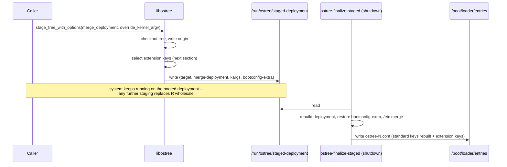
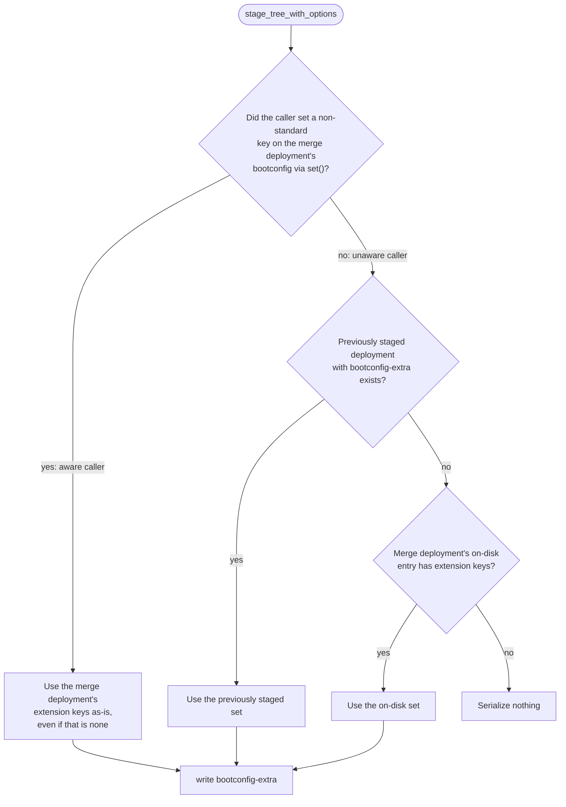

# Extension BLS keys and staged deployments
{: .no_toc }

1. TOC
{:toc}

<!-- SPDX-License-Identifier: (CC-BY-SA-3.0 OR GFDL-1.3-or-later) -->

This document describes how OSTree carries *extension* keys of
[Boot Loader Specification](https://uapi-group.org/specifications/specs/boot_loader_specification/)
(BLS) entries through the staged-deployment lifecycle, and the contract
tools that stage deployments must follow. It is aimed at people changing
`ostree_sysroot_stage_tree_with_options()`, `OstreeBootconfigParser`, or
a tool that stages deployments.

OSTree does not interpret extension keys. The consumer that defines them
today is bootc, which records which kernel arguments a *source* (such as
TuneD) owns in `x-options-source-NAME` keys; that side is described in
[bootc's kernel arguments documentation](https://bootc-dev.github.io/bootc/building/kernel-arguments.html).
Everything here applies to any extension key.

## Standard vs. extension keys

`OstreeBootconfigParser` (`src/libostree/ostree-bootconfig-parser.c`)
keeps every key of an entry in a hash table, so unknown keys survive a
parse → modify → write cycle. It distinguishes two classes:

* **Standard keys** — `title`, `version`, `options`, `linux`, `initrd`,
  `devicetree`, `fdtdir`, `aboot`, `abootcfg`. Owned by OSTree and rebuilt
  from scratch whenever an entry is written
  (`install_deployment_kernel()` in `ostree-sysroot-deploy.c`): the
  kernel, initrd and device-tree paths from the deployment's kernel
  layout, `options` from the deployment's kernel arguments.
* **Extension keys** — everything else. Preserved verbatim.

```
title Fedora Linux 43
version 6.8.0-300.fc40.x86_64
linux /vmlinuz-6.8.0-300.fc40.x86_64
initrd /initramfs-6.8.0-300.fc40.x86_64.img
options root=UUID=... rw ostree=/ostree/boot.0/... nohz=full isolcpus=1-3
x-options-source-tuned nohz=full isolcpus=1-3
x-options-source-dracut
```

An extension key with an empty value is written as the bare key and
read back as an empty string. Consumers use this as a *tombstone*
("the source exists and owns nothing") because the parser has no
remove API.

`_ostree_bootconfig_parser_get_extra_keys_variant()` returns the
extension keys as an `a{ss}` GVariant, or `NULL` if there are none.

## The staging problem

A non-staged deployment (`ostree admin deploy`) writes its BLS entry
immediately, so setting a key on the bootconfig puts it on disk.

A [staged deployment](deployment.md#staged-deployments) does not get an
entry until finalization at shutdown. `ostree_sysroot_stage_tree_with_options()`
serializes what finalization needs into `/run/ostree/staged-deployment`
(an `a{sv}` dictionary on tmpfs):

| Key | Type | Content |
|---|---|---|
| `target` | | Identity of the new deployment |
| `merge-deployment` | | Identity of the deployment used for the `/etc` merge |
| `kargs` | `as` | `override_kernel_argv`, becomes `options` |
| `overlay-initrds` | `as` | Additional initrds |
| `bootconfig-extra` | `a{ss}` | Extension keys to write into the entry (since 2026.1) |

Two properties make this more than "also serialize the extra keys":

1. The new deployment gets a *fresh* bootconfig containing only
   `options` (`_ostree_deployment_set_bootconfig_from_kargs()`), and the
   caller never sees it before serialization. Extension keys therefore
   come from the **merge deployment** the caller passes in — normally the
   booted deployment.
2. Only one staged deployment exists at a time. Any later call to
   `stage_tree_with_options()` in the same boot **replaces** it, possibly
   from a different tool that knows nothing about extension keys. Keys
   that only existed in the replaced staging's data are lost unless the
   replacement carries them forward.



## Selecting the extension keys to carry

Implemented in `_ostree_bootconfig_parser_select_staged_extra_keys()`,
called from `ostree_sysroot_stage_tree_with_options()`. Three candidate
sets exist:

| Candidate | Where it comes from | Freshness |
|---|---|---|
| Merge deployment, **modified in memory** | The caller set extension keys on `merge_deployment`'s bootconfig before calling | The caller's desired state |
| Previously staged deployment | `bootconfig-extra` in the existing `/run/ostree/staged-deployment` | Newer than disk, possibly stale relative to the caller |
| Merge deployment, **on disk** | The entry as parsed from `/boot` | Oldest |



Selection is **all-or-nothing**: exactly one candidate set is used;
sets are never merged key by key.

"Modified" is a flag on `OstreeBootconfigParser`, set by
`ostree_bootconfig_parser_set()` whenever the key is not a standard key.
Parsing a file does not set it, setting `options` (or any standard key)
does not set it, `clone()` copies it, and `_ostree_sysroot_reload_staged()`
clears it after replaying `bootconfig-extra` so that OSTree's own restore
does not count as a caller modification.

### Restore and finalization

When a sysroot is loaded and a staged deployment exists,
`_ostree_sysroot_reload_staged()` rebuilds the in-memory
`OstreeDeployment` and replays `bootconfig-extra` onto its bootconfig.
That is what finalization writes out, and what tools see when they
inspect the staged deployment in-process
(`ostree_deployment_get_bootconfig()`).

### Why this shape

Two kinds of caller stage deployments, and they need opposite
priorities:

* An **aware caller** manages extension keys itself. It reads the
  current state (booted entry *and* staged data), computes the complete
  desired set, and sets every key on the merge deployment before
  staging. That set must win: if a previously staged tombstone were
  allowed to override it, replacing or re-adding a key twice in one boot
  would silently keep the stale tombstone
  ([#3609](https://github.com/ostreedev/ostree/issues/3609)).
* An **unaware caller** (`rpm-ostree`, `bootc upgrade`, `ostree admin
  deploy --stage`) passes the booted deployment through untouched, apart
  from kernel arguments. For it, the previously staged data is strictly
  newer than the on-disk entry and must be preferred. Preferring the
  on-disk entry whenever it has *any* extension key does not work
  either: after a key has been tombstoned the entry still holds it, so
  an unaware re-staging would throw away the real keys of a staged
  change — the failure mode of the first revision of
  [#3611](https://github.com/ostreedev/ostree/pull/3611).

Comparing the merge deployment's in-memory keys with the on-disk entry
to detect "modified" is not enough: an aware caller may legitimately set
a key back to the value that is on disk after a different value was
staged, and that write has to win too. Hence the explicit flag.

Key-by-key merging is avoided on purpose. Because the aware caller
always writes the complete set, a merged result can only differ from it
by re-introducing stale entries; that is what the reverted
[#3587](https://github.com/ostreedev/ostree/pull/3587) did.

### Scenarios

**A** = aware caller, **U** = unaware caller, all within one boot unless
noted. "Tier" is the branch of the flowchart that fires.

| # | Sequence | Result for extension keys | Tier |
|---|---|---|---|
| 1 | A sets `{k: v}` | `{k: v}` | 1 |
| 2 | A sets `{k: v1}`, A sets `{k: v2}` | `{k: v2}`; previously staged `v1` ignored | 1 |
| 3 | A sets `{k: ""}`, A sets `{k: v}`, A sets `{k: ""}` | `{k: ""}`; each call's set wins (#3609) | 1 |
| 4 | A stages `{k: v2}`, then sets `{k: v1}` where `v1` is on disk | `{k: v1}`; a compare-with-disk heuristic would pick `v2` | 1 |
| 5 | A sets `{k: v}`, U re-stages; booted entry has no keys | `{k: v}` inherited | 2 |
| 6 | A sets `{k1, k2}`, U re-stages; booted entry holds `{old: ""}` | `{k1, k2}` inherited, not the on-disk tombstone set | 2 |
| 7 | U re-stages, nothing staged before; booted entry has `{k: v}` | `{k: v}` | 3 |
| 8 | U re-stages, nothing staged, no keys anywhere | nothing serialized | — |
| 9 | Staged deployment used as merge deployment, unmodified | previously staged set (same data) | 2 |
| 10 | U, then U (two unaware re-stagings after an A staging) | carried both times | 2, 2 |

Scenarios 1–7 and 9 have unit tests in
`tests/test-bootconfig-parser-internals.c`; 5 and 6 additionally run
end to end in `tmt/tests/booted/test-bootconfig-extra-staging.sh`.

## Contract for callers

* **You manage extension keys:** before calling
  `ostree_sysroot_stage_tree_with_options()`, read the current state —
  the booted entry *and*, if a staged deployment exists, its bootconfig
  (in-process via `ostree_deployment_get_bootconfig()` on the staged
  deployment, or `bootconfig-extra` in `/run/ostree/staged-deployment`)
  — compute the full desired set, and set every key on the merge
  deployment's bootconfig with `ostree_bootconfig_parser_set()`. Do not
  rely on OSTree to accumulate keys across calls. To retire a key, set it
  to an empty value.
* **You do not manage extension keys:** do nothing. Whatever was
  previously staged or is on disk is carried over.
* **Either way, build the kernel arguments on the deployment you are
  replacing** (the staged one if it exists), or a change that was only
  staged is lost. This is outside OSTree's control; `rpm-ostree` and
  `bootc` do this, `ostree admin deploy --karg-*` builds on the merge
  deployment.
* Requires libostree ≥ 2026.5 for the behaviour described here; 2026.1
  through 2026.4 carry `bootconfig-extra` but drop it when an unaware
  caller re-stages.

## Compatibility

| Scenario | Behaviour |
|---|---|
| Older libostree, aware caller | Keys reach the entry on non-staged deploys only; lost at staged finalization. Kernel arguments are unaffected. |
| 2026.1–2026.4, aware then unaware caller in one boot | Keys of the staged change are dropped (scenarios 5 and 6). |
| New libostree, unaware caller only | No change in behaviour. |
| Upgrade or downgrade with a deployment staged | `bootconfig-extra` is an optional dictionary entry; readers that do not know it ignore it. |
| Non-staged (`ostree admin deploy`) | Not involved; the entry is written directly from the bootconfig. |

## Known limitations

* A staged deployment is replaced wholesale. Two aware callers must each
  read the current staged state before writing, or the earlier change is
  lost together with its extension keys.
* An aware caller cannot express "no extension keys at all" in a way
  that overrides previously staged data: tier 1 only fires if a
  non-standard key was set. Tombstoning with an empty value avoids the
  question.
* Extension keys are inherited from the booted entry into every new
  deployment of the stateroot, including entries written for
  `bls-append` repository configuration. They are not scoped per
  deployment.
* `options` and any bookkeeping a consumer keeps in extension keys can
  drift when a third party edits `options` directly; OSTree does not
  reconcile them.

## History

* [#3570](https://github.com/ostreedev/ostree/pull/3570) (2026.1) —
  `bootconfig-extra` serialization; merge-deployment fallback only.
* [#3587](https://github.com/ostreedev/ostree/pull/3587) (2026.2) —
  key-by-key three-way merge with previously staged data taking priority
  over the merge deployment; regressed repeated staging by an aware
  caller ([#3609](https://github.com/ostreedev/ostree/issues/3609)).
* [#3610](https://github.com/ostreedev/ostree/pull/3610) — reverted #3587.
* [#3611](https://github.com/ostreedev/ostree/pull/3611) — all-or-nothing
  selection with the modified flag described here, unit tests for every
  branch, and the cross-consumer TMT test.

## Tests

* `tests/test-bootconfig-parser-internals.c` — the standard/extension
  split, the modified flag, and every branch of
  `_ostree_bootconfig_parser_select_staged_extra_keys()`.
* `tmt/tests/booted/test-bootconfig-extra-staging.sh` — multi-reboot VM
  test with bootc as the aware caller and `rpm-ostree kargs` as the
  unaware one: cross-consumer re-staging with and without a tombstone on
  the booted entry, several keys coexisting with local kernel arguments,
  and replacement/removal with the resulting entries verified.
